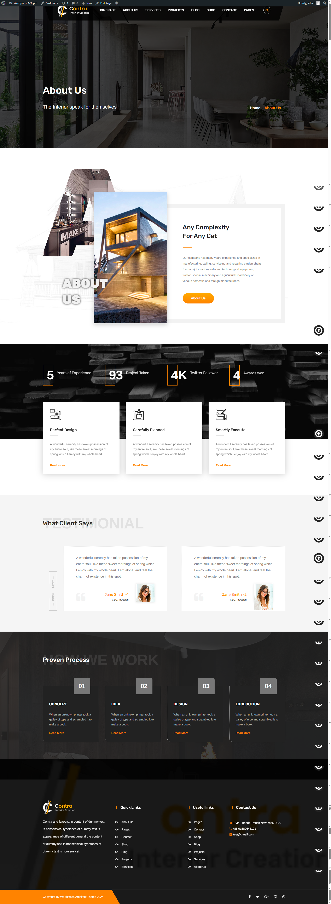
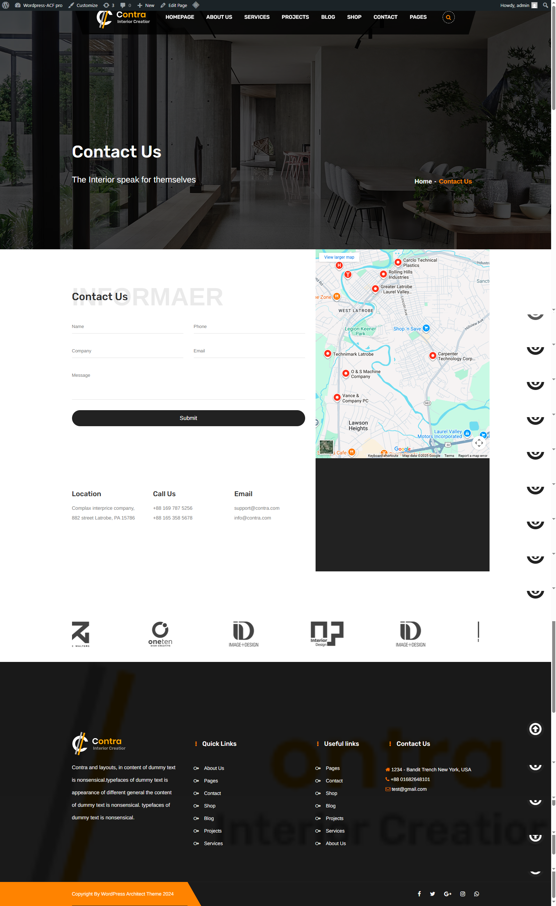
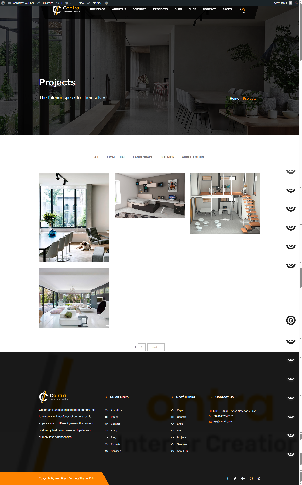
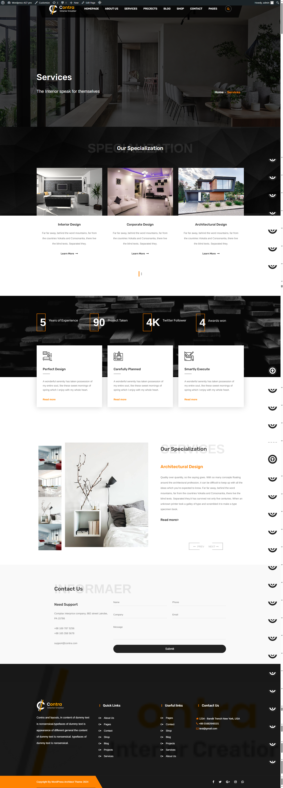
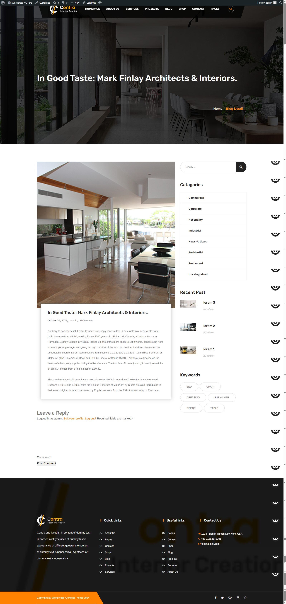
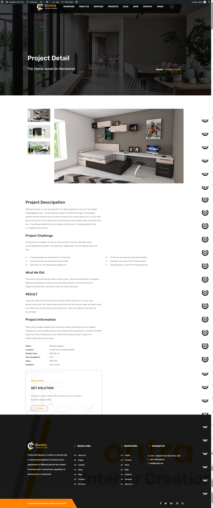

# Contra Interior – Custom WordPress Theme  
A fully custom WordPress theme developed by converting a static HTML template into a dynamic and customizable WordPress website using ACF Pro, PHP, and WordPress template hierarchy.

**Live Demo:** https://contra-interior-creator.infinityfreeapp.com/  
**Author:** Karan Bhanushali

---

## 📌 Overview
Contra Interior is a custom WordPress theme built for an architectural and interior design business.  
The original design was a static HTML template which I converted into a complete WordPress theme with dynamic content management using ACF Pro and custom post types.

This repository contains only the **theme code**—no WordPress core files or plugins.

---

## 🚀 Features

### 🔧 Theme Development
- Converted static HTML into modular WordPress templates
- Implemented the WordPress loop and template hierarchy
- Registered multiple custom menus (`Primary Menu`, `Quick Links`, `Support`)
- Enabled theme supports (post thumbnails, HTML5, custom logo, widgets)

### 🧩 Dynamic Content (ACF Pro)
- Hero section fields  
- About section fields  
- Statistics section  
- Service section  
- Footer fields  
- Custom field groups for Projects

### 📁 Custom Post Type (ACF)
- **Projects** post type created using ACF’s Post Type feature  
- Custom ACF fields for project details  
- Displayed via a custom shortcode (`project-shortcode.php`)

### 🧱 Shortcodes
Included custom shortcodes:
- Project Listing  
- Team Listing  
- News Post Listing  

### 🎨 Frontend
- Bootstrap-based responsive layout  
- CSS animations & WOW.js  
- Custom sliders using Owl Carousel  
- Fancybox gallery support

### ACF JSON
All ACF field groups are stored in `/acf-json/` so that the theme automatically loads the correct fields when activated.

---

## ⚙️ Installation

1. Download the theme folder  
2. Place it into:  
   `wp-content/themes/`
3. Activate it from **Appearance → Themes**
4. Install and activate **ACF Pro**  
5. Import ACF JSON (if included)
6. Configure menus, widgets, and add ACF data  

---

## 🧪 Requirements
- WordPress 6.x+
- PHP 7.4 or higher
- ACF Pro plugin installed
- MySQL database

---

## 🌐 Live Demo
See the full website here:  
**https://contra-interior-creator.infinityfreeapp.com/**

---

## 📸 Screenshots
Below are some screenshots from the theme.  
Images are stored in the `/Images/` folder of the repository.

## *HomePage*
<!-- This is a comment and will not appear in the rendered README -->

<!-- -->

## *About US*

## *Blog*

## *Contact*

## *Projects*

## *Services*

## *Single-Blog*

## *Project-single*

---

## 🧑‍💻 Author
**Karan Bhanushali**  
WordPress Developer | PHP | ACF | Theme Development  

If you like this theme, feel free to ⭐ star the repository!

---

## 📜 License
This theme is for demonstration and learning purposes.  
Commercial reuse of the original HTML template may require proper licensing.
